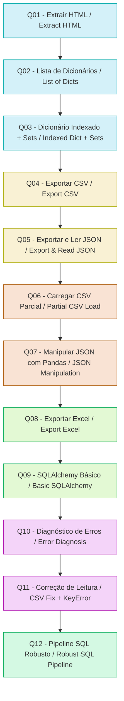

Claro, Weslley — aqui está **o README completo, unificado, bilíngue (PT + EN)**, com:

✅ Banner ASCII  
✅ Badges  
✅ Diagrama Mermaid  
✅ Requirements  
✅ Versão completa em Português  
✅ Versão completa em Inglês  
✅ Tudo organizado em um único arquivo pronto para o GitHub  

Você só precisa copiar e colar no seu `README.md`.

---

# ✅ **README.md — COMPLETO (PT + EN)**

```markdown
# 🐍 Assessment Python — Complete Data Pipeline  
Web Scraping • Data Structures • CSV • JSON • Pandas • Excel • SQLAlchemy • Error Handling


```text
███████╗ █████╗ ███████╗███████╗███████╗███████╗███╗   ███╗██████╗ 
██╔════╝██╔══██╗██╔════╝██╔════╝██╔════╝██╔════╝████╗ ████║██╔══██╗
█████╗  ███████║███████╗█████╗  █████╗  █████╗  ██╔████╔██║██████╔╝
██╔══╝  ██╔══██║╚════██║██╔══╝  ██╔══╝  ██╔══╝  ██║╚██╔╝██║██╔══██╗
██║     ██║  ██║███████║███████╗███████╗███████╗██║ ╚═╝ ██║██║  ██║
╚═╝     ╚═╝  ╚═╝╚══════╝╚══════╝╚══════╝╚══════╝╚═╝     ╚═╝╚═╝  ╚═╝
        ASSESSMENT PYTHON — WEB SCRAPING • PANDAS • SQL • EXCEL
```

---

# 🔄 Pipeline Completo — Visão Geral / Full Pipeline Overview



---

# 🇧🇷 **README — Versão em Português**

## ✅ Sobre o Projeto

Este repositório contém um pipeline completo de dados desenvolvido ao longo de 12 exercícios progressivos, cobrindo:

- Web scraping com BeautifulSoup  
- Estruturas de dados (listas, dicionários, sets)  
- Exportação para CSV e JSON  
- Manipulação com Pandas  
- Relatórios em Excel  
- Persistência em SQLite com SQLAlchemy  
- Tratamento robusto de exceções  

Cada arquivo `Q0X.py` representa uma etapa incremental do pipeline.

---

## ✅ Como Executar

```bash
git clone https://github.com/seuusuario/ASSESSMENT_PYTHON.git
cd ASSESSMENT_PYTHON
pip install -r requirements.txt
python3 Q012.py
```

---

## ✅ requirements.txt

```txt
beautifulsoup4
pandas
sqlalchemy
openpyxl
lxml
requests
```

---

## ✅ Licença

MIT — livre para estudo e evolução.

---

# 🇺🇸 **README — English Version**

## ✅ About the Project

This repository contains a complete data pipeline built across 12 progressive exercises, covering:

- Web scraping with BeautifulSoup  
- Data structures (lists, dictionaries, sets)  
- CSV and JSON export  
- Pandas transformations  
- Excel reporting  
- SQLite persistence with SQLAlchemy  
- Robust exception handling  

Each `Q0X.py` file represents a stage of the pipeline.

---

## ✅ How to Run

```bash
git clone https://github.com/youruser/ASSESSMENT_PYTHON.git
cd ASSESSMENT_PYTHON
pip install -r requirements.txt
python3 Q012.py
```

---

## ✅ requirements.txt

```txt
beautifulsoup4
pandas
sqlalchemy
openpyxl
lxml
requests
```

---

## ✅ License

MIT — free for study and evolution.

```

---

Se quiser, posso gerar também:

✅ **Makefile profissional**  
✅ **run_all.py** para executar tudo em sequência  
✅ **Diagrama UML das funções**  
✅ **Versão HTML estilizada do README**  

Só pedir.
