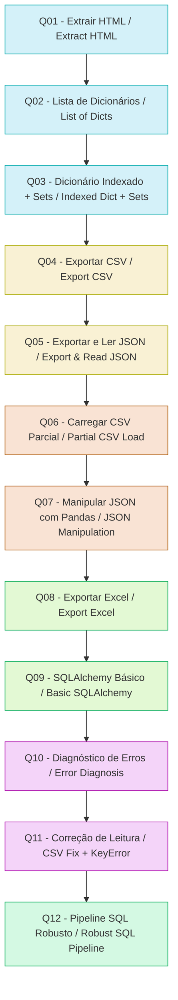

```markdown
# 🐍 Assessment Python — Pipeline Completo de Dados  
Web Scraping • Estruturas de Dados • CSV • JSON • Pandas • Excel • SQLAlchemy • Tratamento de Exceções

Este repositório contém um pipeline completo de processamento de dados desenvolvido ao longo de 12 exercícios progressivos.  
O objetivo é demonstrar domínio de:

- Extração de dados estruturados  
- Manipulação com listas, dicionários e sets  
- Exportação para CSV e JSON  
- Carregamento parcial com Pandas  
- Filtragem e transformação  
- Geração de relatórios em Excel  
- Persistência em banco SQLite com SQLAlchemy  
- Tratamento robusto de exceções  

---

# 🔄 Pipeline Completo — Visão Geral / Full Pipeline Overview



---

# ✅ Estrutura do Repositório

Cada arquivo representa uma etapa incremental do pipeline:

- **Q01** — Extração HTML com BeautifulSoup  
- **Q02** — Conversão para lista de dicionários  
- **Q03** — Dicionário indexado + detecção de duplicatas  
- **Q04** — Exportação para CSV  
- **Q05** — Exportação e leitura de JSON  
- **Q06** — Carregamento parcial de CSV com Pandas  
- **Q07** — Manipulação de JSON com Pandas  
- **Q08** — Exportação para Excel  
- **Q09** — Pipeline SQL básico com SQLAlchemy  
- **Q10** — Diagnóstico de erros do pipeline  
- **Q11** — Correção da leitura + tratamento de KeyError  
- **Q12** — Pipeline SQL robusto com try/except/finally  

---

# ✅ Como Executar

```bash
git clone https://github.com/seuusuario/ASSESSMENT_PYTHON.git
cd ASSESSMENT_PYTHON
pip install -r requirements.txt
python3 Q012.py
```

---

# ✅ Requirements

```txt
beautifulsoup4
pandas
sqlalchemy
openpyxl
lxml
requests
```

---

# ✅ Licença

MIT — livre para estudo e evolução.

```

---

