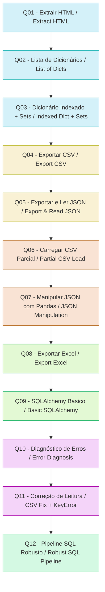

# 🔄 Pipeline Completo — Visão Geral / Full Pipeline Overview




```markdown
# 🐍 Assessment Python — Pipeline Completo de Dados  
Web Scraping • Estruturas de Dados • CSV • JSON • Pandas • Excel • SQLAlchemy • Tratamento de Exceções

Este repositório contém um pipeline completo de processamento de dados desenvolvido ao longo de 12 exercícios progressivos.  
O objetivo é demonstrar domínio de:

- Extração de dados estruturados
- Manipulação com listas, dicionários e sets
- Exportação para CSV e JSON
- Carregamento parcial com Pandas
- Filtragem e transformação
- Geração de relatórios em Excel
- Persistência em banco SQLite com SQLAlchemy
- Tratamento robusto de exceções em todas as etapas

---

## 📌 Estrutura do Projeto

```
ASSESSMENT_PYTHON/
│
├── Q01.py  → Extração HTML (BeautifulSoup)
├── Q02.py  → Conversão da tabela em lista de dicionários
├── Q03.py  → Construção de dicionário indexado + detecção de duplicatas
├── Q04.py  → Exportação para CSV
├── Q05.py  → Exportação e leitura de JSON
├── Q06.py  → Carregamento parcial de CSV com Pandas
├── Q07.py  → Manipulação de JSON com Pandas
├── Q08.py  → Exportação para Excel
├── Q09.py  → Pipeline SQL básico com SQLAlchemy
├── Q010.py → Diagnóstico de erros (sem correção)
├── Q011.py → Correção da etapa de leitura + KeyError
├── Q012.py → Pipeline SQL robusto com try/except/finally
│
└── dados_scraping.csv / dados_scraping.json / relatorio_final.xlsx
```

---

## ✅ **Resumo dos Exercícios**

### **Q01 — Extração da Tabela HTML**
- Uso de BeautifulSoup
- Conversão da tabela em estrutura navegável

### **Q02 — Lista de Dicionários**
- Cada linha da tabela vira um dicionário
- Cada coluna vira uma chave

### **Q03 — Dicionário Indexado + Set**
- Indexação por coluna única (ex.: `"Game"`)
- Detecção de duplicatas com `set`
- Relatório final:

```
Total de registros: X
Total de valores únicos: Y
Duplicatas encontradas: [...]
```

### **Q04 — Exportação para CSV**
- Uso de `csv.DictWriter`
- Tratamento de exceções de escrita

### **Q05 — Exportação e Leitura de JSON**
- `json.dump` e `json.load`
- Tratamento de erros de leitura/escrita

### **Q06 — Carregamento Parcial com Pandas**
- `usecols=[...]`
- Ordenação por coluna específica

### **Q07 — Manipulação de JSON com Pandas**
- `pd.read_json`
- Necessidade de `df.T` (transposição)
- Renomeação de colunas
- Filtros por valores

### **Q08 — Exportação para Excel**
- `df.to_excel(..., index=False)`
- Geração de relatório final

### **Q09 — SQLAlchemy Básico**
- Engine SQLite em memória
- Escrita e leitura via Pandas

### **Q10 — Diagnóstico de Erros**
- Identificação de:
  - FileNotFoundError
  - KeyError
  - UnboundLocalError
  - OperationalError
- Sem correção — apenas análise

### **Q11 — Correção da Leitura + KeyError**
- Uso de `StringIO`
- Blocos `try/except/else/pass`
- Pipeline continua mesmo com falhas

### **Q12 — Pipeline SQL Robusto**
- Conexão protegida com try/except
- Escrita com try/except/else
- Query com try/except
- Encerramento com finally
- Mensagem final:

```
Pipeline corrigido e executado com sucesso!
```

---

## 🚀 **Como Executar o Projeto**

### 1. Clonar o repositório
```bash
git clone https://github.com/seuusuario/ASSESSMENT_PYTHON.git
cd ASSESSMENT_PYTHON
```

### 2. Criar ambiente virtual (opcional)
```bash
python3 -m venv venv
source venv/bin/activate
```

### 3. Instalar dependências
```bash
pip install -r requirements.txt
```

### 4. Executar qualquer exercício
```bash
python3 Q07.py
python3 Q012.py
```

---

## 📦 **Tecnologias Utilizadas**

- Python 3.x  
- BeautifulSoup4  
- Pandas  
- SQLAlchemy  
- SQLite  
- JSON / CSV / Excel  
- Tratamento avançado de exceções  

---

## 🧠 **Conceitos Trabalhados**

- Web scraping estruturado  
- Estruturas de dados eficientes  
- Persistência em múltiplos formatos  
- Pipelines resilientes  
- SQL + Pandas  
- Tratamento de erros em produção  

---

## ✅ **Resultado Final**

Ao final do projeto, você terá:

- Um pipeline completo e robusto
- Capaz de extrair, transformar, validar, persistir e consultar dados
- Com tolerância a falhas e logs claros
- Pronto para ser expandido para ETLs reais

---

## 📄 Licença

Este projeto é livre para estudo e evolução.

